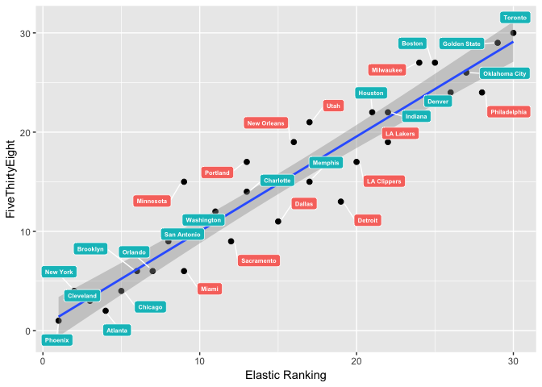
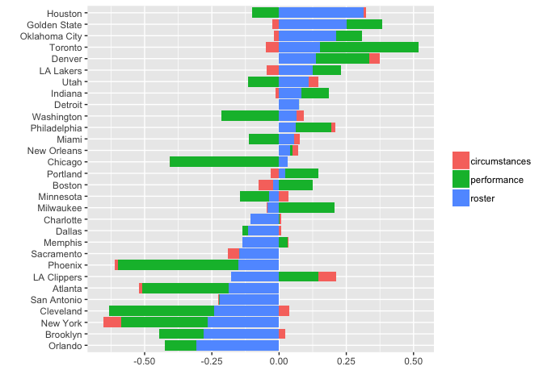

Golden State will Three-peat
============================

We're roughly 30 games into the 2018-2019 season and I finally got around to updating the [Elastic NBA Ratings](https://github.com/klarsen1/NBA_RANKINGS). For those who didn't see my previous posts on the Elastic NBA Ratings, they are based on a statistical model that predicts the winner of a given match-up using variables such as team performance, the quality of the roster, and circumstances (travel, home court advantage, etc).

Let's get straight to the key results: the chart below shows team ranks based on predicted win-rates the Elastic model as well as the [FiveThirtyEight model](https://projects.fivethirtyeight.com/2019-nba-predictions/). The green labels indicate cities where the two models are in agreement (within 2 ranks), and the red labels denote disagreements of three ranks or more.

``` r
library(tidyr)
library(dplyr)
library(knitr)
library(ggrepel) ## downloaded from github

 
f <-
  "https://raw.githubusercontent.com/klarsen1/NBA_RANKINGS/master/rankings/rankings_2018-12-13.csv"
 
all_rankings <- read.csv(f) %>%
  mutate(elastic_ranking=min_rank(season_win_rate),
         FiveThirtyEight=min_rank(pred_win_rate_538),
         absdiff=ifelse(abs(elastic_ranking-FiveThirtyEight)>2, 0, 1)) %>%
  select(team, conference, division, elastic_ranking, FiveThirtyEight, absdiff) %>%
  arrange(elastic_ranking)
 
ggplot(all_rankings, aes(x=elastic_ranking, y=FiveThirtyEight)) +
  xlab("Elastic Ranking") + ylab("FiveThirtyEight") +
  geom_point(size = 2, color = 'black') +
  geom_smooth(method='lm') + 
  geom_label_repel(aes(elastic_ranking, FiveThirtyEight, label = team, fill=factor(absdiff)),
                  fontface = 'bold', color = 'white', size=2,
                  box.padding = unit(0.35, "lines"),
                  point.padding = unit(0.5, "lines")) + 
  theme(legend.title = element_blank()) + theme(legend.position="none")
```



The models agree that Toronto and Golden State are two the top teams. If we believe this, we have to believe that these two teams will meet in the finals. But which team is the best team? Who will be the NBA champs? If go by the chart above, and consider the fact that Toronto beat Golden State in their two only match-ups this year, you have to go with Toronto.

But there's more to it than this.

Making Sense of the Predictions
===============================

In order to understand why the Elastic Ranking model is favoring Toronto over Golden State, we can *decompose* the contributions to the model predictions into three parts:

-   Roster -- archetype allocation deficits/surpluses. This group of variables reflects the quality of the roster.
-   Performance -- e.g., win percentages, previous match-ups.
-   Circumstances -- e.g., travel, rest, home-court advantage

The code below shows how to plot the decomposition of the playoff predictions:

``` r
library(tidyr)
library(dplyr)
library(knitr)
library(ggplot2)

f <-
  "https://raw.githubusercontent.com/klarsen1/NBA_RANKINGS/master/modeldetails/score_decomp_2018-12-13.csv"
 
center <- function(x){return(x-median(x))}
read.csv(f, stringsAsFactors = FALSE) %>%
  select(selected_team, roster, circumstances, performance) %>%
  group_by(selected_team) %>%
  summarise_each(funs(mean)) %>% ## get averages across games by team
  mutate(order=roster) %>%
  arrange(order) %>%
  ungroup() %>%
  mutate_each(funs(center), which(sapply(., is.numeric))) %>% ## standardize across teams
  gather(modelpart, value, roster:performance) %>% ## transpose
  rename(team=selected_team) %>%
  ggplot(aes(x=reorder(team, order), value)) + geom_bar(aes(fill=modelpart), stat="identity") + coord_flip() +
  xlab("") + ylab("") + theme(legend.title = element_blank())
```



The bars show the contribution from each part of the model. Longer, more positive bars mean that the given team is stronger in that category compared to its playoff competitors. Here are the takeaways:

-   Toronto is the best team right now, but the decomposition shows that their top rating is mainly coming from the team's performance this season. This could mean that Toronto is punching above its weight.

-   Golden State has a better roster than Toronto. But the Dubs are clearly under-performing this season so far -- which is typical for a team coming off two straight championships and four straight finals appearances.

-   Houston has a very strong and balanced roster, but they can't seem to get it together.

The Final Takes
===============

You know where I'm going with this. If Golden State meets Toronto in the finals, I have no doubt Golden State will win -- barring any major injuries or kicks to the groin.

The finals is a different beast than the regular season, and Golden State has more experience dealing with this than any other team. Also, they'll be fired up when they're back on the big stage and the boredom will go away.

In fact, I think that the largest threat to Golden State is a fully functioning Houston team, not Toronto.
